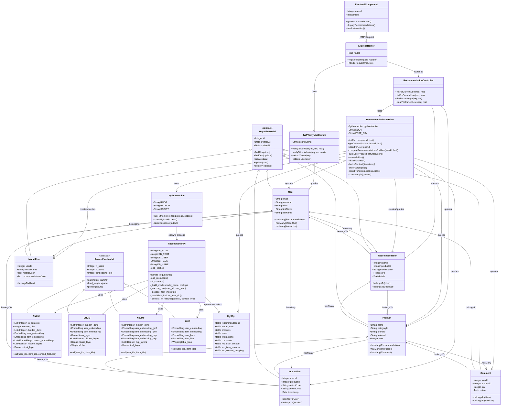

# Biểu đồ lớp - Hệ thống gợi ý sản phẩm E-commerce
## (Class Diagram - MVC Architecture)

## Ghi chú

### RecommendationService
- **Business Logic Layer**: Xử lý logic tính toán gợi ý, quản lý cache, đánh giá models, fallback heuristic scoring

### PythonInvoker
- **Bridge Pattern**: Spawn Python process, giao tiếp qua stdin/stdout, JSON serialization

### ENCM (Embedding-based Neural Context Model)
- **Context-aware Model**: Sử dụng time, season, device, category
- **Architecture**: Embedding-based neural network

### LNCM (Linear Neural Combination Model)
- **Linear + Neural Combination**: Matrix Factorization + MLP
- **Learnable alpha weight**: Tự động học trọng số kết hợp

### NeuMF (Neural Matrix Factorization)
- **Two-tower Architecture**: GMF (Generalized MF) + MLP
- **Hybrid approach**: Kết hợp factorization và deep learning

### BMF (Bias Matrix Factorization)
- **Simple but effective**: User/Item embeddings + biases
- **Fast inference**: Nhẹ và nhanh

