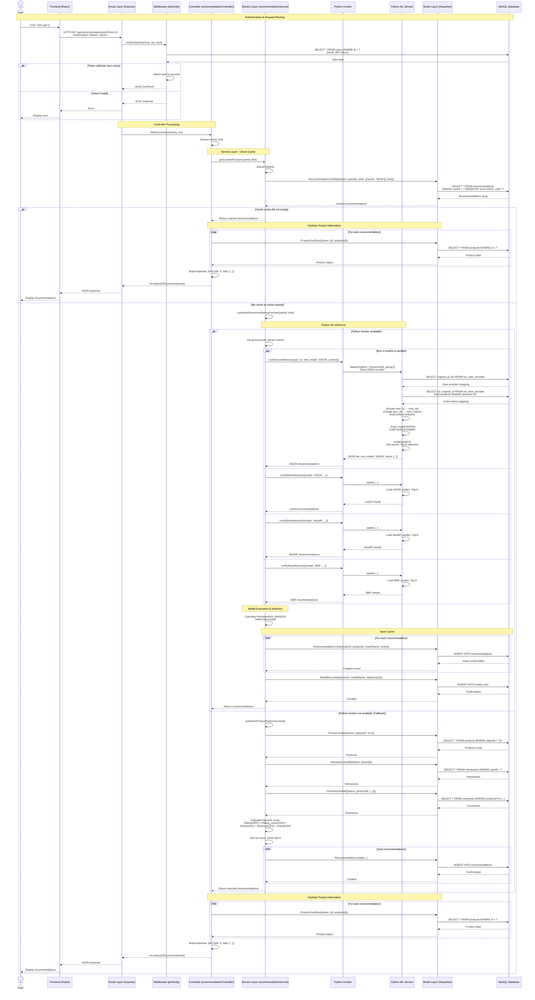

# Biểu đồ tuần tự - Hệ thống gợi ý sản phẩm E-commerce
## (MVC Pattern với Service Layer)

```mermaid
sequenceDiagram
    actor User
    participant Frontend as Frontend (React)
    participant Route as Route Layer (Express)
    participant Middleware as Middleware (jwtVerify)
    participant Controller as Controller (recommendationController)
    participant Service as Service Layer (recommendationService)
    participant PythonInvoker as Python Invoker
    participant PythonService as Python ML Service
    participant Model as Model Layer (Sequelize)
    participant Database as MySQL Database

    Note over User,Database: Authentication & Request Routing
    
    User->>Frontend: Click "Xem gợi ý"
    Frontend->>Route: HTTP GET /api/recommendations/list?limit=10<br/>Authorization: Bearer <token>
    
    Route->>Middleware: verifyTokenUser(req, res, next)
    Middleware->>Database: SELECT * FROM users WHERE id = ?<br/>(Verify JWT token)
    Database-->>Middleware: User data
    
    alt Token valid && User exists
        Middleware->>Middleware: Attach user to req.user
        Middleware-->>Route: next() (continue)
    else Token invalid
        Middleware-->>Route: Error response
        Route-->>Frontend: Error
        Frontend-->>User: Display error
    end
    
    Note over Route,Controller: Controller Processing
    
    Route->>Controller: listForCurrentUser(req, res)
    Controller->>Controller: Extract userId, limit
    
    Note over Controller,Service: Service Layer - Check Cache
    
    Controller->>Service: getCachedForUser(userId, limit)
    Service->>Service: ensureTables()
    
    Service->>Model: Recommendation.findAll({where: {userId}, order: [['score', 'DESC']], limit})
    Model->>Database: SELECT * FROM recommendations<br/>WHERE userId = ? ORDER BY score DESC LIMIT ?
    Database-->>Model: Recommendations array
    Model-->>Service: Cached recommendations
    
    alt Cache exists && not empty
        Service-->>Controller: Return cached recommendations
        
        Note over Controller,Model: Hydrate Product Information
        
        loop For each recommendation
            Controller->>Model: Product.findOne({where: {id: productId}})
            Model->>Database: SELECT * FROM products WHERE id = ?
            Database-->>Model: Product data
            Model-->>Controller: Product object
        end
        
        Controller->>Controller: Build response: {errCode: 0, data: [...]}
        Controller-->>Route: res.status(200).json(response)
        Route-->>Frontend: JSON response
        Frontend-->>User: Display recommendations
        
    else No cache or cache expired
        Service->>Service: computeRecommendationsForUser(userId, limit)
        
        Note over Service,PythonService: Python ML Inference
        
        alt Python Invoker available
            Service->>Service: Get ground truth, derive context
            
            par Run 4 models in parallel
                Service->>PythonInvoker: runPythonInference({user_id, limit, model: 'ENCM', context})
                PythonInvoker->>PythonService: spawn('python', ['recommend_api.py'])<br/>Send JSON via stdin
                
                PythonService->>Database: SELECT original_id, idx FROM rec_user_encoder
                Database-->>PythonService: User encoder mapping
                
                PythonService->>Database: SELECT idx, original_id FROM rec_item_encoder<br/>JOIN products WHERE statusId='S1'
                Database-->>PythonService: Active items mapping
                
                PythonService->>PythonService: Encode user_id → user_idx<br/>Encode item_ids → item_indices<br/>Build context features
                PythonService->>PythonService: _build_model('ENCM')<br/>Load config & weights
                PythonService->>PythonService: model.predict()<br/>Get scores, Top-K selection
                
                PythonService-->>PythonInvoker: JSON {ok: true, model: 'ENCM', items: [...]}
                PythonInvoker-->>Service: ENCM recommendations
            and
                Service->>PythonInvoker: runPythonInference({model: 'LNCM', ...})
                PythonInvoker->>PythonService: spawn(...)
                PythonService->>PythonService: Load LNCM, predict, Top-K
                PythonService-->>PythonInvoker: LNCM results
                PythonInvoker-->>Service: LNCM recommendations
            and
                Service->>PythonInvoker: runPythonInference({model: 'NeuMF', ...})
                PythonInvoker->>PythonService: spawn(...)
                PythonService->>PythonService: Load NeuMF, predict, Top-K
                PythonService-->>PythonInvoker: NeuMF results
                PythonInvoker-->>Service: NeuMF recommendations
            and
                Service->>PythonInvoker: runPythonInference({model: 'BMF', ...})
                PythonInvoker->>PythonService: spawn(...)
                PythonService->>PythonService: Load BMF, predict, Top-K
                PythonService-->>PythonInvoker: BMF results
                PythonInvoker-->>Service: BMF recommendations
            end
            
            Note over Service: Model Evaluation & Selection
            
            Service->>Service: Calculate Precision@10, MAP@10<br/>Select best model
            
            Note over Service,Database: Save Cache
            
            loop For each recommendation
                Service->>Model: Recommendation.create({userId, productId, modelName, score})
                Model->>Database: INSERT INTO recommendations
                Database-->>Model: Insert confirmation
                Model-->>Service: Created record
            end
            
            Service->>Model: ModelRun.create({userId, modelName, metricsJson})
            Model->>Database: INSERT INTO model_runs
            Database-->>Model: Confirmation
            Model-->>Service: Created
            
            Service-->>Controller: Return recommendations
            
        else Python Invoker not available (Fallback)
            Service->>Service: buildUserProductFeatures(userId)
            
            Service->>Model: Product.findAll({where: {statusId: 'S1'}})
            Model->>Database: SELECT * FROM products WHERE statusId = 'S1'
            Database-->>Model: Products array
            Model-->>Service: Products
            
            Service->>Model: Interaction.findAll({where: {userId}})
            Model->>Database: SELECT * FROM interactions WHERE userId = ?
            Database-->>Model: Interactions
            Model-->>Service: Interactions
            
            Service->>Model: Comment.findAll({where: {productId: [...]}})
            Model->>Database: SELECT * FROM comments WHERE productId IN (...)
            Database-->>Model: Comments
            Model-->>Service: Comments
            
            Service->>Service: Calculate heuristic score:<br/>Rating(45%) + Rating_count(15%) +<br/>Views(15%) + Discount(15%) + Intent(10%)
            Service->>Service: Sort by score, select top-K
            
            loop Save recommendations
                Service->>Model: Recommendation.create(...)
                Model->>Database: INSERT INTO recommendations
                Database-->>Model: Confirmation
                Model-->>Service: Created
            end
            
            Service-->>Controller: Return heuristic recommendations
        end
        
        Note over Controller,Model: Hydrate Product Information
        
        loop For each recommendation
            Controller->>Model: Product.findOne({where: {id: productId}})
            Model->>Database: SELECT * FROM products WHERE id = ?
            Database-->>Model: Product data
            Model-->>Controller: Product object
        end
        
        Controller->>Controller: Build response: {errCode: 0, data: [...]}
        Controller-->>Route: res.status(200).json(response)
        Route-->>Frontend: JSON response
        Frontend-->>User: Display recommendations
    end
```

